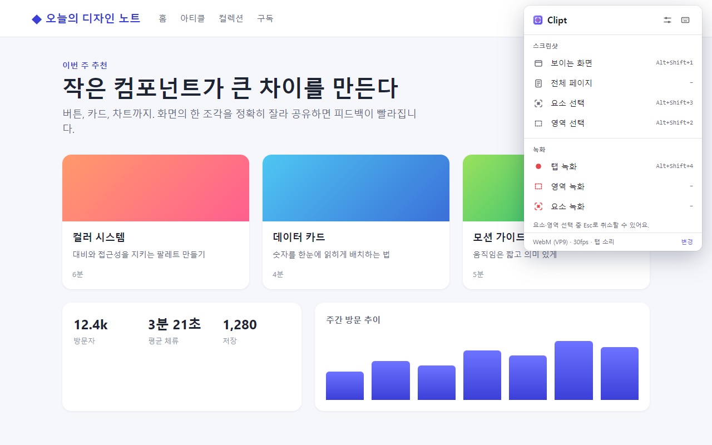
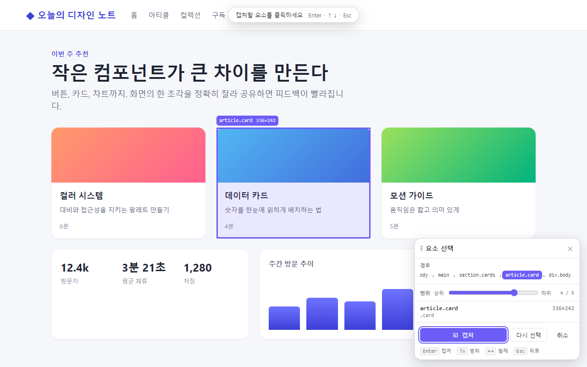
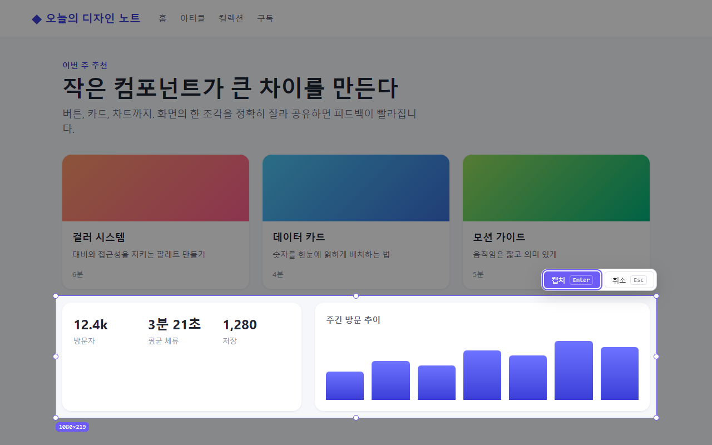
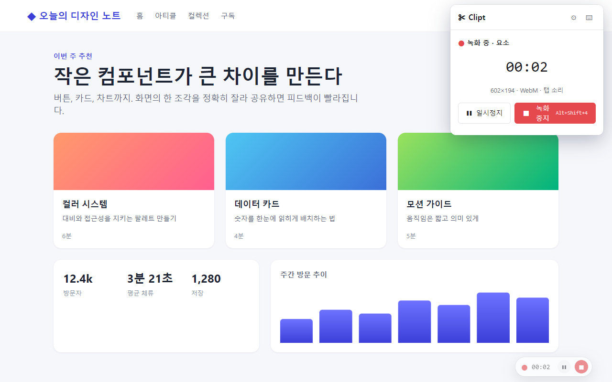
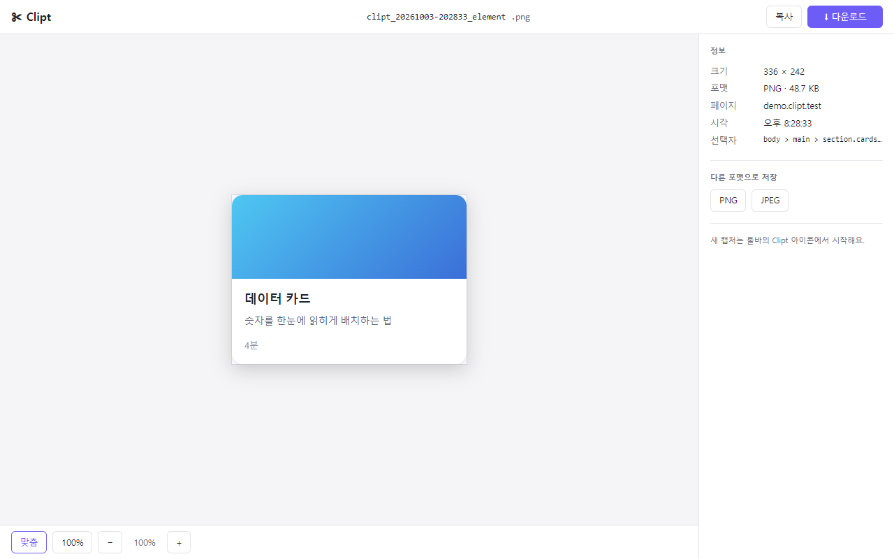
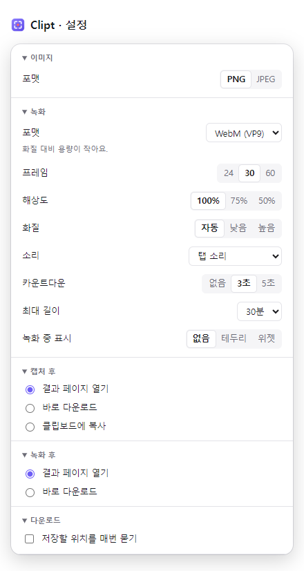

# Clipt – Screenshot & Screen Recorder

> Clip anything on the web.

웹페이지를 원하는 범위만큼 캡처하거나 녹화하는 Chrome 확장 프로그램 (Manifest V3)

**[설치 ZIP 다운로드](https://github.com/dydtjr1128/clipt/releases/latest/download/clipt.zip)** · [설치·업데이트 안내](INSTALL.md) · [릴리스 노트](https://github.com/dydtjr1128/clipt/releases/latest) · [변경기록](CHANGELOG.md)



## 사용 흐름

툴바 아이콘 클릭(또는 단축키) → 기능 선택 → 범위 지정 → 결과 확인 및 저장

## 기능

### 📸 스크린샷

- **보이는 화면**: 지금 보이는 화면을 바로 캡처
- **전체 페이지**: 자동으로 스크롤하며 페이지 전체를 한 장으로 이어 붙임. 고정 헤더는 한 번만, 지연 로딩 이미지는 채워서 캡처
- **요소**: 마우스로 요소를 고르고 선택 패널에서 범위를 조정해 캡처. 화면보다 긴 요소도 이어 붙여 한 장으로
- **영역**: 드래그로 고른 범위만 캡처. 가장자리로 끌면 자동 스크롤되어 화면보다 큰 영역도 가능

| 요소 선택 | 영역 선택 |
| --- | --- |
|  |  |

### 🎬 녹화

- **탭 녹화**: 현재 탭 화면 전체를 녹화. 페이지를 이동해도 계속 녹화
- **영역 녹화**: 드래그로 고른 범위만 녹화(보이는 화면 안)
- **요소 녹화**: 요소 캡처와 같은 방식으로 선택, 패널에서 녹화 시작
  - **요소 따라가기**(기본 켬): 녹화 중 스크롤하거나 요소가 움직여도 요소를 따라감. 끄면 시작할 때의 화면 위치를 그대로 녹화
  - 영상 크기는 시작할 때의 요소 크기로 고정. 요소 크기가 바뀌면 비율을 지켜 가운데에 맞추고, 요소가 화면 밖으로 나가면 직전 화면을 유지
- 작은 요소·영역은 영상이 최소 160px, 가로세로 4:1 이내가 되도록 검은 여백을 두고 가운데에 담음(확대하지 않음). 재생 컨트롤에 가려 보이지 않는 것을 막기 위함
- 녹화 중에는 팝업에 시간·일시정지·중지가 보이고, 툴바 배지에 `REC` 표시. 설정에서 페이지 위 테두리·위젯 표시를 켤 수 있음(영역·요소 녹화 결과에는 찍히지 않음)
- 카운트다운, 일시정지·재개, 최대 길이 자동 중지, 탭 소리·마이크 녹음 지원. 브라우저가 비정상 종료되면 다음에 결과 페이지에서 복구 가능



### 🖼 결과 페이지

캡처·녹화가 끝나면 새 탭에 결과가 열림(설정에서 바로 다운로드·클립보드 복사로 바꿀 수 있음).

- 이미지 미리보기(맞춤·100%·확대·축소, Ctrl+휠), 영상 재생·탐색
- 파일명 편집 후 다운로드, 이미지 클립보드 복사, PNG·JPEG로 다시 저장
- 크기·포맷·용량·페이지·선택자 등 정보 표시



## 요소 선택 방식 (요소 캡처 / 요소 녹화 공통)

### 1단계: 호버

- 마우스를 움직이면 커서 아래 요소의 범위가 반투명 색상 박스로 표시됨
- 박스 옆에 태그명과 크기(예: `div.card 320×180`) 라벨 표시

### 2단계: 클릭으로 선택

- 클릭하면 캡처되지 않고 해당 요소가 **선택 상태로 고정**됨. 고정 후에는 마우스를 움직여도 선택이 바뀌지 않음
- 선택 중 클릭은 페이지 원래 동작(링크 이동 등)이 실행되지 않도록 막음

### 3단계: 선택 패널에서 미세조정

선택하면 화면에 패널이 뜸(헤더를 끌어 위치 이동 가능)

- **요소 경로**: `body > div > div.container > div.card > img` 형태. 항목을 클릭하면 그 요소로 이동
- **깊이 슬라이더**: 왼쪽은 상위 요소, 오른쪽은 하위 요소. 움직이면 선택 범위가 실시간으로 바뀜
- **선택 요소 정보**: 태그명, id/class, 크기
- **버튼**: 요소 따라가기 토글(요소 녹화만), 캡처(요소 녹화는 "녹화 시작"), 다시 선택, 취소

### 키보드 조작

- 호버 단계에서 `Enter`·`↑`·`↓`: 마우스가 가리키는 요소(없으면 화면 가운데 요소)를 선택해 고정. 단축키로 시작하면 마우스 없이 끝까지 조작 가능
- `↑` / `↓`: 상위 / 하위 요소로 이동
- `←` / `→`: 같은 깊이의 이전 / 다음 요소로 이동(Shadow DOM 안에서도)
- `Enter`: 캡처 (또는 녹화 시작)
- `Esc`: 선택 해제 후 호버 상태로, 한 번 더 누르면 종료

선택 표시·라벨·패널은 캡처·녹화 결과에 찍히지 않는다.

## 단축키

| 키 | 동작 |
| --- | --- |
| `Alt+Shift+1` | 보이는 화면 캡처 |
| `Alt+Shift+2` | 영역 캡처 |
| `Alt+Shift+3` | 요소 캡처 |
| `Alt+Shift+4` | 탭 녹화 시작 / 중지 |

전체 페이지 캡처, 영역·요소 녹화는 `chrome://extensions/shortcuts`에서 키를 지정할 수 있다(Chrome은 기본 키를 4개까지만 허용). 선택·카운트다운·전체 페이지 캡처 중에는 `Esc`로 취소하고, 녹화는 팝업·위젯·`Alt+Shift+4`로 끝낸다.

## 설정

팝업의 ⚙ 또는 확장 옵션 페이지에서 바꾼다. 바로 저장되고, Chrome 동기화를 켜면 다른 기기와 함께 쓰인다.



| 구분 | 항목 | 선택지 (기본값 굵게) |
| --- | --- | --- |
| 이미지 | 포맷 | **PNG** / JPEG (JPEG 품질 60~100%, 기본 92%) |
| 녹화 | 포맷 | MP4 / **WebM VP9** / WebM VP8 / WebM AV1 (지원하지 않는 포맷은 비활성, 안 되면 자동 대체) |
| | 프레임 | 24 / **30** / 60 fps |
| | 해상도 | **100%** / 75% / 50% |
| | 화질 | **자동** / 낮음 / 높음 |
| | 소리 | 소리 없음 / **탭 소리** / 마이크 / 탭 소리 + 마이크 (마이크는 권한 페이지에서 한 번 허용) |
| | 카운트다운 | 끔 / **3초** / 5초 |
| | 최대 길이 | 5 / 10 / **30** / 60분 (도달하면 그때까지 저장) |
| | 녹화 중 표시 | **없음** / 테두리 / 위젯 (탭 녹화에서는 결과에 함께 찍힘) |
| 캡처 후 | 동작 | **결과 페이지 열기** / 바로 다운로드 / 클립보드에 복사 |
| 녹화 후 | 동작 | **결과 페이지 열기** / 바로 다운로드 |
| 다운로드 | 저장할 위치를 매번 묻기 | 켬 / **끔** |

## 결과 보관

결과는 브라우저 안(IndexedDB)에만 저장하고 어떤 서버로도 보내지 않는다. 만든 지 24시간이 지난 결과는 지우고, 전체가 500MB를 넘으면 오래된 결과부터 지운다. 용량 때문에 지울 때는 가장 최근 결과(긴 녹화 하나가 500MB를 넘어도)와 지금 열어 둔 결과를 남긴다. 계속 둘 결과는 다운로드한다.

## 권한과 개인정보

- `activeTab`으로 아이콘·단축키로 실행한 탭에만 잠깐 접근한다. 모든 사이트 접근 권한(host 권한)을 요청하지 않는다
- 권한별 사용 이유는 [docs/store/permissions.md](docs/store/permissions.md), 개인정보 처리방침은 [PRIVACY.md](PRIVACY.md)

## 알아둘 점

- `chrome://` 페이지, Chrome 웹 스토어, 다른 확장 페이지에서는 Chrome 정책상 동작하지 않는다(팝업이 안내)
- `file://` 페이지는 확장 관리 화면에서 "파일 URL에 대한 액세스 허용"을 켠 경우에만 동작
- iframe 안의 요소는 따로 고를 수 없고 iframe 전체를 하나의 요소로 다룬다
- 페이지 안쪽 영역만 스크롤되는 앱형 페이지는 전체 페이지 캡처가 보이는 만큼만 담긴다(결과 페이지에 안내)
- 영역·요소 녹화는 보이는 화면만 담으며, 녹화 중 페이지를 이동하거나 창 크기를 바꾸면 그때까지 저장하고 끝난다
- 영상은 클립보드 복사를 지원하지 않는다. MP4 녹화는 Chrome 126 이상에서 쓸 수 있다

## 개발

```bash
npm install
npm run dev
```

빌드·검사·테스트 명령과 작업 규칙은 [AGENTS.md](AGENTS.md), 구조는 [docs/architecture.md](docs/architecture.md), 화면·문구는 [docs/ux-design.md](docs/ux-design.md), 테스트 전략은 [docs/testing.md](docs/testing.md). README의 화면 캡처는 `npm run build:e2e` 뒤 `npm run screenshots`로 다시 만든다.
